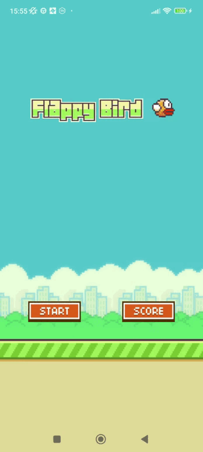

# Flappy Bird, only C, without Java/Kotlin 
  
## Build:  
- Download Visual Studio 2022
- - Open Visual Studio Installer
- - Click "Edit"
- - Check the following items: Development of classic applications in C++, Development of mobile applications in C++
- Download Android Studio (we need apktool, sdk, ndk from it)
- - Install NDK 25.2.9519653 (you can use the version above)
- In the project, the setting is made for "Debug ARM", but make changes to build.bat (look at the paths)
- Compile via CTRL + B
